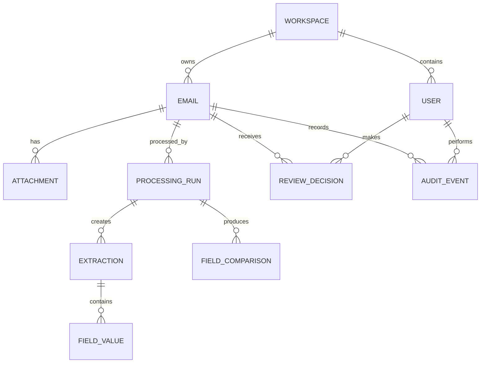

# CargoClarity — Database Design

## 1. Design goals

The database must represent the inbox, source documents, extraction attempts, field-level decisions, human review, and audit history. It must preserve original evidence while allowing a case to be reprocessed with a new parser or model. Final reports should be reproducible from stored records.

PostgreSQL is the recommended implementation because the data is relational, JSON fields are useful for provider metadata, and transactions are important when recording human overrides.

## 2. Entity relationship model

## 3. Tables and entities

### `workspaces`

Stores the tenant or project boundary.

| Column | Type | Constraints |
|---|---|---|
| `id` | UUID | Primary key |
| `name` | TEXT | Required |
| `created_at` | TIMESTAMPTZ | Required |

### `users`

Stores application users and roles.

| Column | Type | Constraints |
|---|---|---|
| `id` | UUID | Primary key |
| `workspace_id` | UUID | Foreign key, required |
| `email` | CITEXT | Required within workspace |
| `display_name` | TEXT | Required |
| `role` | TEXT | `reviewer` or `supervisor` |
| `created_at` | TIMESTAMPTZ | Required |

### `emails`

Stores the source inbox record without a predicted label embedded in the source.

| Column | Type | Constraints |
|---|---|---|
| `id` | UUID | Primary key |
| `workspace_id` | UUID | Foreign key, required |
| `source_email_id` | TEXT | Required; unique within workspace |
| `sender` | TEXT | Required |
| `subject` | TEXT | Required |
| `body` | TEXT | Required |
| `source_payload` | JSONB | Original source metadata |
| `created_at` | TIMESTAMPTZ | Required |
| `updated_at` | TIMESTAMPTZ | Required |

### `attachments`

Stores metadata and private object-storage references.

| Column | Type | Constraints |
|---|---|---|
| `id` | UUID | Primary key |
| `email_id` | UUID | Foreign key, required |
| `filename` | TEXT | Required |
| `document_role` | TEXT | `SI`, `BL`, `UNKNOWN`, or `OTHER` |
| `mime_type` | TEXT | Required |
| `size_bytes` | BIGINT | Required |
| `sha256` | TEXT | Required |
| `object_key` | TEXT | Required; never public |
| `readability_status` | TEXT | `READABLE`, `UNREADABLE`, `EMPTY`, or `UNSUPPORTED` |
| `created_at` | TIMESTAMPTZ | Required |

### `processing_runs`

Represents one complete or partial attempt to process an email.

| Column | Type | Constraints |
|---|---|---|
| `id` | UUID | Primary key |
| `email_id` | UUID | Foreign key, required |
| `status` | TEXT | `QUEUED`, `RUNNING`, `SUCCEEDED`, or `FAILED` |
| `category` | TEXT | Nullable until classification completes |
| `category_confidence` | NUMERIC(5,4) | Range 0–1 |
| `status_result` | TEXT | `OK`, `MISMATCH`, or `NEEDS_REVIEW` |
| `review_reason` | TEXT | Nullable; typed reason |
| `has_defect` | BOOLEAN | Required after completion |
| `parser_version` | TEXT | Required |
| `model_provider` | TEXT | Nullable |
| `model_name` | TEXT | Nullable |
| `started_at` | TIMESTAMPTZ | Required |
| `completed_at` | TIMESTAMPTZ | Nullable |
| `error_code` | TEXT | Nullable |

### `field_values`

Stores each extracted field independently so that evidence and confidence are visible.

| Column | Type | Constraints |
|---|---|---|
| `id` | UUID | Primary key |
| `processing_run_id` | UUID | Foreign key, required |
| `attachment_id` | UUID | Foreign key, required |
| `document_role` | TEXT | `SI` or `BL` |
| `field_name` | TEXT | One of the seven canonical fields |
| `raw_value` | TEXT | Nullable |
| `normalized_value` | TEXT | Nullable |
| `numeric_value` | NUMERIC | Nullable |
| `unit` | TEXT | Nullable |
| `confidence` | NUMERIC(5,4) | Range 0–1 |
| `evidence_excerpt` | TEXT | Nullable |
| `evidence_location` | JSONB | Page, row, or line metadata |
| `extraction_method` | TEXT | `RULE`, `AI`, `OCR`, or `HUMAN` |

### `field_comparisons`

Stores the comparison between the SI reference and BL candidate.

| Column | Type | Constraints |
|---|---|---|
| `id` | UUID | Primary key |
| `processing_run_id` | UUID | Foreign key, required |
| `field_name` | TEXT | Canonical field, unique per run |
| `si_field_value_id` | UUID | Foreign key, nullable |
| `bl_field_value_id` | UUID | Foreign key, nullable |
| `result` | TEXT | `MATCH`, `MISMATCH`, or `UNCERTAIN` |
| `confidence` | NUMERIC(5,4) | Range 0–1 |
| `comparison_method` | TEXT | Rule description |
| `explanation` | TEXT | Required after completion |

### `review_decisions`

Stores human confirmations and corrections without overwriting the original machine result.

| Column | Type | Constraints |
|---|---|---|
| `id` | UUID | Primary key |
| `email_id` | UUID | Foreign key, required |
| `processing_run_id` | UUID | Foreign key, required |
| `reviewer_id` | UUID | Foreign key, required |
| `decision` | TEXT | `CONFIRMED`, `OVERRIDDEN`, or `UNRESOLVED` |
| `corrected_status` | TEXT | Required |
| `corrected_fields` | JSONB | Corrected field outcomes |
| `reason` | TEXT | Required |
| `created_at` | TIMESTAMPTZ | Required |

### `audit_events`

Provides append-only traceability.

| Column | Type | Constraints |
|---|---|---|
| `id` | UUID | Primary key |
| `workspace_id` | UUID | Foreign key, required |
| `email_id` | UUID | Foreign key, nullable |
| `actor_type` | TEXT | `USER`, `SYSTEM`, or `AI_SERVICE` |
| `actor_id` | UUID | Nullable for system actors |
| `event_type` | TEXT | Required |
| `event_data` | JSONB | Required |
| `created_at` | TIMESTAMPTZ | Required |

## 4. Integrity rules

A processing run may have only one comparison result per canonical field. `has_defect` must be true only when the final status is `MISMATCH`. `NEEDS_REVIEW` must have a review reason and must not be converted into a mismatch solely because a value is blank or unreadable. Original source payloads and raw extracted values are immutable. Human corrections create new records.

## 5. Indexes and retention

Create indexes on `emails.workspace_id`, `emails.source_email_id`, `processing_runs.email_id`, `processing_runs.status_result`, `processing_runs.category`, `attachments.sha256`, and `audit_events.email_id, created_at`. Attachments should have a configurable retention period. Audit records should be retained longer than transient processing artifacts.

## References

[1]: ./System%20Architecture.md "CargoClarity System Architecture"
[2]: ./API%20Specification.md "CargoClarity API Specification"
[3]: ./Security%20%26%20Privacy.md "CargoClarity Security and Privacy"
[4]: ./review_notes.md "Project review notes and official hackathon requirements"
