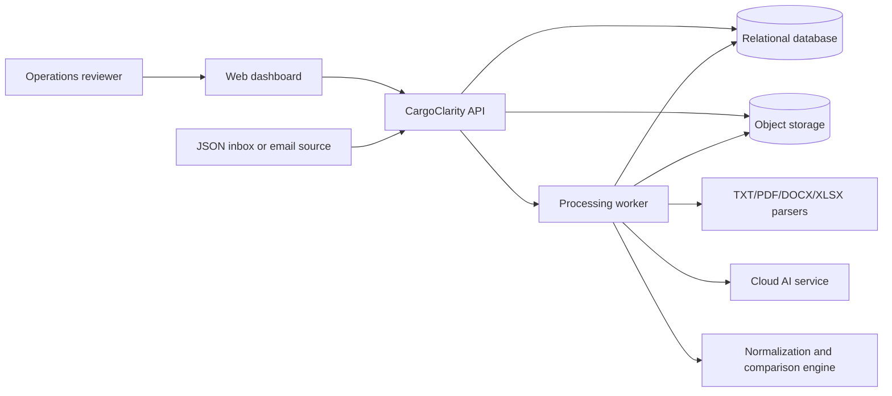
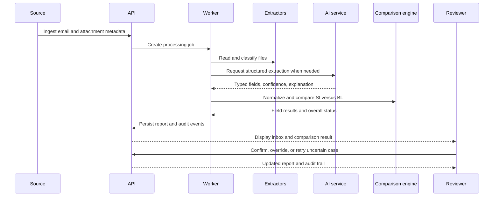

# CargoClarity — System Architecture

## 1. Architectural summary

CargoClarity is a layered, event-oriented verification system. The frontend presents an inbox and review workspace. The backend orchestrates ingestion, classification, document parsing, extraction, comparison, review, and reporting. A relational database stores durable operational state and audit history. Object storage retains uploaded or source attachments. A cloud AI service assists with ambiguous classification, structured extraction, and explanations.

The system deliberately separates **AI assistance** from **decision control**. AI proposes structured values and explanations. Deterministic validators, comparison rules, confidence thresholds, and human review determine the final operational status.

## 2. Context diagram

## 3. Processing flow

## 4. Components

### 4.1 Web dashboard

The dashboard provides the inbox queue, filters, processing states, case detail, evidence drawer, review controls, and report export. It never calls the AI provider directly. It uses the backend API and receives only the minimum data needed for the current user and case.

### 4.2 API service

The API validates requests, authorizes access, creates processing jobs, serves normalized read models, records reviewer actions, and returns report exports. It should remain stateless so that multiple instances can be deployed behind a cloud load balancer.

### 4.3 Processing worker

The worker executes potentially slow operations outside the synchronous API request. It downloads or reads attachments, identifies file types, extracts text or tables, calls AI when needed, applies normalization, runs comparison rules, and persists every attempt. A queue is appropriate for a production extension; a background task or single worker is sufficient for the hackathon prototype.

### 4.4 Format parsers

The parser layer uses text extraction for TXT and PDF, table-aware readers for DOCX and XLSX, and an OCR or vision adapter for image-only files. Each adapter returns text blocks, tables, metadata, and a parser confidence. Unsupported or corrupted content produces a typed failure instead of an empty successful result.

### 4.5 AI adapter

The AI adapter receives bounded document text or selected excerpts and requests schema-constrained JSON. It may classify ambiguous email text, identify document roles, extract fields, and generate a concise explanation. The adapter records provider, model, prompt version, latency, and response validation outcome. Sensitive content should be minimized before sending it to an external provider.

### 4.6 Decision engine

The decision engine canonicalizes field labels, normalizes values, applies field-specific comparison rules, calculates a confidence score, and maps the result to `OK`, `MISMATCH`, or `NEEDS_REVIEW`. It is deterministic and testable without an AI provider.

### 4.7 Persistence and object storage

The database stores email metadata, processing attempts, extracted fields, field comparisons, review decisions, and audit events. Object storage stores original and derived files using private keys. Database records contain object references rather than public file URLs.

## 5. Confidence model

Confidence is not a claim that the system is correct. It is a decision-support signal derived from extraction quality, evidence availability, parsing quality, and comparison strength.

A practical prototype score is:

`field_confidence = 0.35 × extraction_confidence + 0.25 × evidence_quality + 0.25 × comparison_strength + 0.15 × format_quality`

The weights should be configurable and calibrated against representative examples. Suggested bands are **HIGH** at 0.85 or above, **MEDIUM** from 0.60 to 0.84, and **LOW** below 0.60. A missing required value, wrong document type, or unreadable file overrides the numeric score and produces `NEEDS_REVIEW`.

## 6. Deployment

For the hackathon, deploy the frontend as a cloud-hosted web application and the backend as a cloud container or managed service. Use a managed relational database and private object storage where available. Store AI credentials as cloud secrets. The local development mode should accept the supplied static bundle or local Docker server so that the team can test deterministically.

## 7. Scalability and resilience

The API and worker should be independently scalable. Jobs should be idempotent by email and attachment checksum. Retries should be bounded and should distinguish transient provider failures from permanent parsing failures. Caching extracted text and validated AI responses reduces cost and latency. Observability should include structured logs, job duration, parser failure rate, AI failure rate, review rate, and exact defect-field accuracy.

## References

[1]: ./cargoclarity_prd.md "CargoClarity Product Requirements Document"
[2]: ./Functional%20Requirements.md "CargoClarity Functional Requirements"
[3]: ./Database%20Design.md "CargoClarity Database Design"
[4]: ./API%20Specification.md "CargoClarity API Specification"
[5]: ./Security%20%26%20Privacy.md "CargoClarity Security and Privacy"
[6]: ./review_notes.md "Project review notes and official hackathon requirements"
